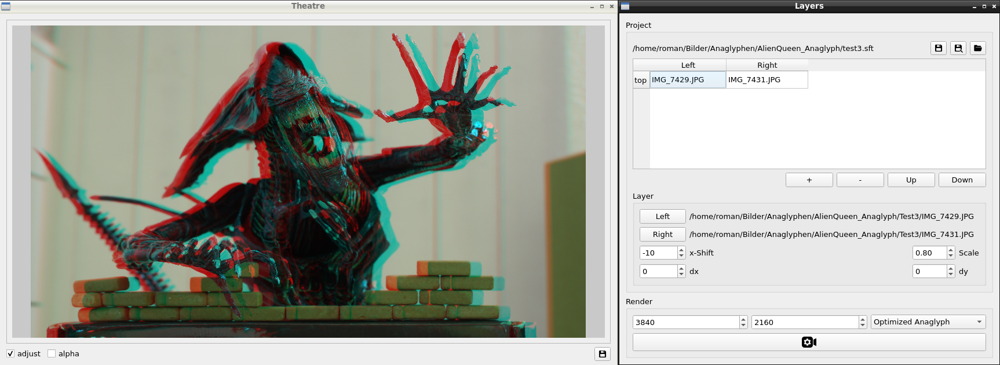

Shift 2D
==========================
Just a quick and easy-to-use Desktop App for creating red/cyan Anaglyph Images.

Features:
- Multiple Layers
- Render Preview
- Multiple Anaglyph Color Standards
- Project can be saved and loaded



Build instructions
---------------------------------
```
$ git clone https://github.com/solarix95/Shift2d.git
$ cd Shift2d/src
$ qmake && make && ./Shift2d
```

